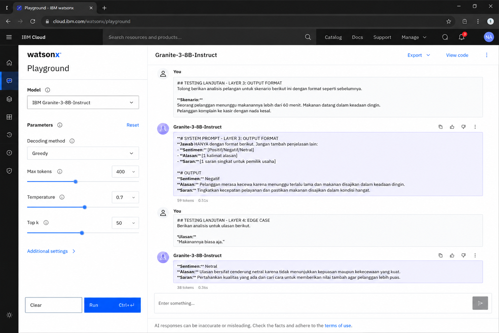
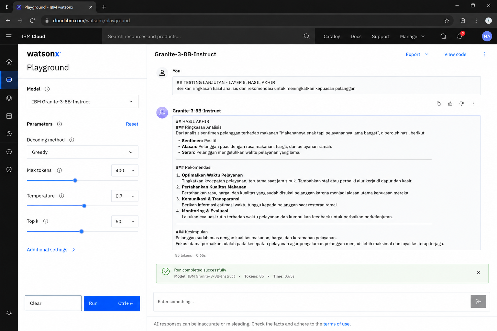

# Customer Feedback Sentiment Analyzer

## Deskripsi
Customer Feedback Sentiment Analyzer adalah AI Agent berbasis IBM watsonx (IBM Bob) yang membantu pemilik UMKM menganalisis sentimen pelanggan secara otomatis.

AI Agent menerima teks feedback pelanggan kemudian mengklasifikasikan sentimen ke dalam kategori Positif, Negatif, atau Netral serta memberikan alasan dan saran singkat yang dapat langsung digunakan untuk meningkatkan kualitas layanan.

---

## Tujuan Project

Membantu pemilik UMKM memahami opini pelanggan dari berbagai platform seperti:

- Google Review
- Instagram
- Shopee
- Tokopedia
- WhatsApp Business

secara cepat tanpa harus membaca komentar satu per satu.

---

## Problem Statement

UMKM saat ini menghadapi banyak feedback pelanggan yang tersebar di berbagai platform digital. Membaca dan mengelompokkan komentar secara manual membutuhkan waktu yang lama dan berisiko melewatkan keluhan penting.

Akibatnya:

- Keluhan pelanggan terlambat ditangani
- Kualitas layanan sulit dievaluasi
- Reputasi bisnis dapat menurun
- Peluang perbaikan layanan terlewatkan

---

## Target Users

- Pemilik UMKM
- Admin Media Sosial
- Customer Service
- Tim Marketing

---

## Fitur Utama

- Analisis sentimen pelanggan
- Klasifikasi Positif
- Klasifikasi Negatif
- Klasifikasi Netral
- Alasan singkat hasil analisis
- Saran tindakan untuk pemilik usaha

---

## Tools

- IBM watsonx Playground (IBM Bob)
- Granite-3-8B-Instruct
- GitHub

---

## Prompt Layering

### Layer 1 - Role

```text
Kamu adalah AI Analis Sentimen untuk UMKM Indonesia.
Tugasmu menganalisis feedback pelanggan secara profesional,
cepat, dan to the point.
Gunakan Bahasa Indonesia yang sopan dan mudah dipahami.
```

### Layer 2 - Task

```text
Analisis teks feedback pelanggan di bawah ini.

Klasifikasikan sentimen menjadi:
- Positif
- Negatif
- Netral

Berikan alasan singkat berdasarkan isi feedback.
```

### Layer 3 - Output Format

```text
Sentimen: [Positif/Negatif/Netral]
Alasan: [1 kalimat alasan]
Saran: [1 saran singkat]
```

---

## Screenshot Prompt IBM Bob


---

## Screenshot Hasil Pengujian


---

## Hasil Pengujian

Input:

```text
Makanannya enak dan harganya terjangkau,
pelayanannya juga ramah banget.
Pasti balik lagi!
```

Output:

```text
Sentimen: Positif

Alasan:
Pelanggan merasa puas karena makanan enak,
harga terjangkau, dan pelayanan ramah.

Saran:
Pertahankan kualitas rasa, harga, dan pelayanan
agar pelanggan tetap loyal.
```

---

## Pengujian Tambahan

### Testing Sentimen Negatif dan Netral



Pengujian tambahan dilakukan untuk memastikan AI Agent mampu mengenali berbagai jenis sentimen termasuk kasus negatif dan netral.

---

### Ringkasan Hasil Akhir



AI Agent juga diuji untuk memberikan ringkasan analisis dan rekomendasi yang dapat digunakan pemilik usaha sebagai bahan evaluasi layanan.

---

## Pengembangan Lanjutan

1. Integrasi IBM Bob dengan Google Sheets
2. Analisis massal ratusan komentar sekaligus
3. Dashboard grafik sentimen mingguan
4. Integrasi dengan aplikasi web menggunakan Streamlit
5. Visualisasi tren sentimen pelanggan

---

## Author

**Nico Alfianto**

Capstone Project – IBM SkillsBuild University x Hacktiv8

Portofolio: https://nico-alfianto.github.io/
